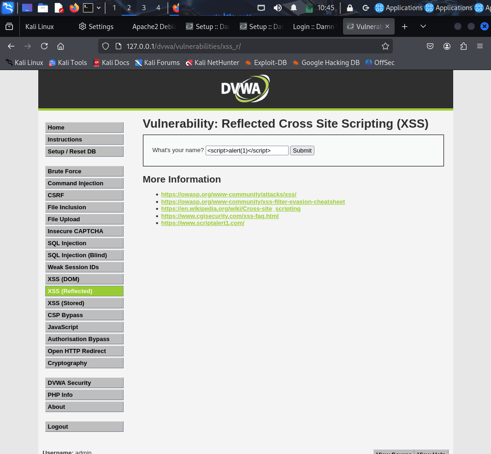
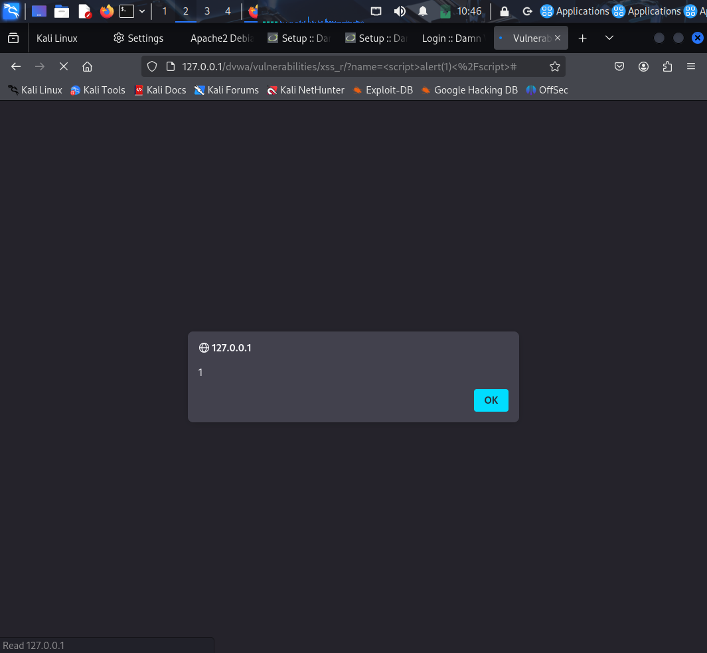
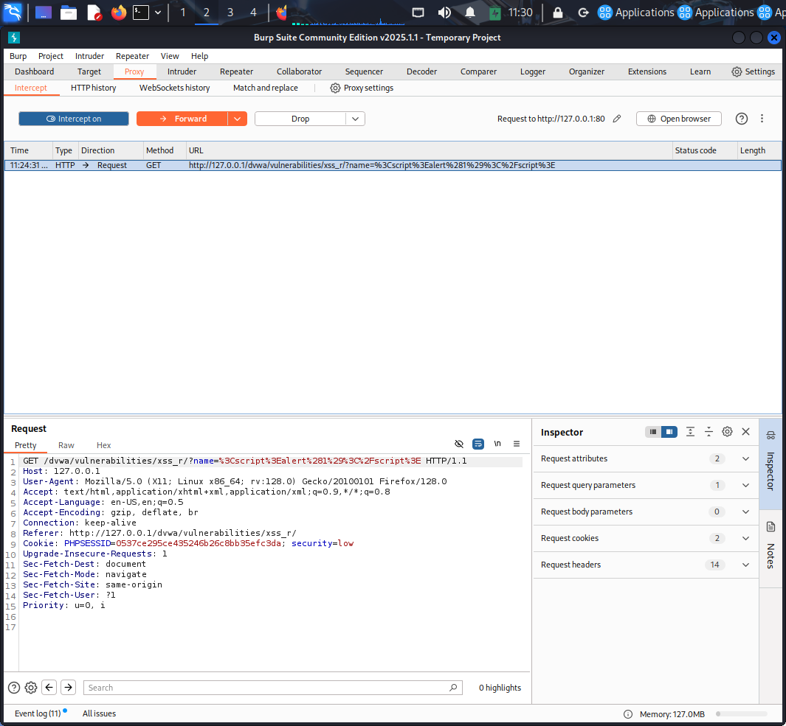

# 🔐 Web Application Security Testing using DVWA & Burp Suite (XSS Analysis)

## 📌 Overview
This project demonstrates hands-on web application security testing using Damn Vulnerable Web Application (DVWA) and Burp Suite in a controlled lab environment. The objective was to understand how client-side vulnerabilities occur and how they can be analyzed using real-world security tools.

---

## 🧪 Scenario
A Reflected Cross-Site Scripting (XSS) vulnerability was tested by injecting a script payload into a web application. The application failed to properly sanitize user input, resulting in script execution in the browser.

---

## ⚙️ Tools Used
- Kali Linux  
- DVWA  
- Burp Suite  

---

## 🚀 What I Did
- Set up DVWA in a local Kali Linux environment  
- Configured Burp Suite as an intercepting proxy  
- Performed Reflected XSS testing using a sample payload  
- Intercepted and analyzed HTTP requests using Burp Suite  
- Observed how user input is processed and reflected in the response  

---

## 📸 Screenshots

### 🔹 XSS Payload Input (DVWA)

### 🔹 XSS Execution (Alert Popup)

### 🔹 HTTP Request Interception (Burp Suite)

---

## 🧠 Key Findings
- User input was reflected without proper sanitization  
- Script payload executed successfully in the browser  
- HTTP request captured in Burp Suite confirmed payload transmission  
- Demonstrates how Reflected XSS vulnerabilities occur in web applications  

---

## 🧠 Key Learnings
- How Reflected XSS vulnerabilities work  
- Importance of input validation and output encoding  
- How to intercept and analyze HTTP requests using Burp Suite  
- Understanding client-server interaction in web applications  

---

## ⚠️ Disclaimer
This project was conducted in a controlled lab environment for educational purposes only.
